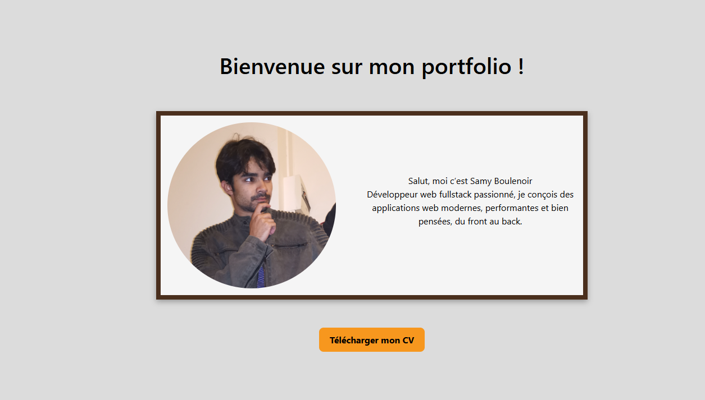

# 💼 Portfolio – Samy Boulenoir

Bienvenue sur mon portfolio !  
Ce projet a pour but de présenter mon profil, mes compétences et mes projets en développement web fullstack.

---

## 🚀 Aperçu

🌐 [Voir en ligne le portfolio](à définir)  
📁 Code source disponible ici : [GitHub – SamyBoulenoir](https://github.com/SamyBoulenoir)

---

## 🧑‍💻 À propos de moi

Je m'appelle **Samy Boulenoir**, développeur web **fullstack** passionné.  
J’aime concevoir des interfaces modernes, performantes et intuitives.  
Ce site est une vitrine de mon parcours, effectué dans le cadre de ma formation openclassrooms.

---

## 🛠 Technologies utilisées

- **React.js** (v18) – Interface utilisateur
- **CSS3** – Design responsive
- **Framer Motion** – Animations fluides
- **React Bootstrap** – Composants UI
- **JS Vanilla** – Contrôle scroll, navigation dynamique
- **SVG & Flexbox** – Composants graphiques légers

---

## 🧩 Fonctionnalités

✅ Navigation en **diapositive verticale** (scroll slide par slide)  
✅ **Menu flottant animé** pour accéder à chaque section  
✅ Sections :
- **Accueil**
- **À propos**
- **Compétences**
- **Projets**
- **CV (téléchargeable)**

✅ Composants réactifs et adaptatifs sur tous les écrans  
✅ Thème harmonisé avec une **palette personnalisée en variables CSS**

---

## 📷 Aperçu visuel



---

## 📁 Installation et lancement

```bash
# Cloner le projet
git clone https://github.com/SamyBoulenoir/portfolio.git

# Accéder au dossier
cd portfolio

# Installer les dépendances
npm install

# Lancer le serveur local
npm run dev
